# C++搜索引擎项目类图

## 完整类图Mermaid代码

```mermaid
classDiagram
    %% ===== 服务器核心架构层 =====
    class SearchEngineServer {
        -ThreadPool threadPool_
        -TcpServer tcpServer_
        -unique_ptr~DataReaderManager~ dataManager_
        -string dataDirectory_
        -bool running_
        +SearchEngineServer(threadNum, queueSize, ip, port)
        +start() void
        +stop() void
        +setDataDirectory(dataDir) void
        -onNewConnection(connection) void
        -onMessage(connection) void
        -onClose(connection) void
    }

    class TcpServer {
        -Acceptor acceptor_
        -EventLoop loop_
        +TcpServer(ip, port)
        +start() void
        +stop() void
        +setAllCallback(cb1, cb2, cb3) void
    }

    class ThreadPool {
        -size_t threadNum_
        -vector~thread~ threads_
        -size_t queSize_
        -TaskQueue taskQueue_
        -bool isExit_
        +ThreadPool(threadNum, queSize)
        +start() void
        +stop() void
        +addTask(task) void
    }

    class SearchEngineTask {
        -string message_
        -TcpConnectionPtr connection_
        -DataReaderManager* dataManager_
        +SearchEngineTask(message, connection, dataManager)
        +process() void
        -handleKeywordRecommendRequest(request) void
        -handleSearchRequest(request) void
    }

    %% ===== 数据访问层 =====
    class DataReaderManager {
        -unique_ptr~ChineseDictionaryReader~ chineseDictReader_
        -unique_ptr~EnglishDictionaryReader~ englishDictReader_
        -unique_ptr~WebPageLibraryReader~ webPageLibraryReader_
        +initialize(dataDir) bool
        +getChineseDictionaryReader() ChineseDictionaryReader*
        +getEnglishDictionaryReader() EnglishDictionaryReader*
    }

    class DictionaryReader {
        <<abstract>>
        +loadDictionary(dictPath) bool
        +getWordFrequency(word) int
    }

    class ChineseDictionaryReader {
        -unordered_map~string,int~ wordFreqMap_
        +loadDictionary(dictPath) bool
        +getWordFrequency(word) int
    }

    class EnglishDictionaryReader {
        -unordered_map~string,int~ wordFreqMap_
        +loadDictionary(dictPath) bool
        +getWordFrequency(word) int
    }

    class WebPageLibraryReader {
        -vector~WebPageOffset~ offsetsList_
        +loadWebPages(webpagesPath) bool
        +getWebPageByDocid(docid) WebPage
    }

    %% ===== 业务逻辑层 =====
    class WebSearchEngine {
        -DataReaderManager* dataManager_
        -LRUCache searchCache_
        +search(query, topN) vector~SearchResult~
        +calculateCosineSimilarity() double
    }

    class KeywordRecommender {
        -DataReaderManager* dataManager_
        -TextProcessor textProcessor_
        +recommendKeywords(query, k) vector~Candidate~
        +calculateEditDistance() int
    }

    %% ===== 分词处理层 =====
    class UnifiedTokenizer {
        -unique_ptr~EnglishTokenizer~ englishTokenizer_
        -unique_ptr~ChineseTokenizer~ chineseTokenizer_
        +processDirectories() bool
    }

    class EnglishTokenizer {
        -unique_ptr~StopWordsManager~ stopWordsManager_
        -unordered_map~string,int~ wordFrequency_
        +processDirectory() bool
        +processFiles() bool
    }

    class ChineseTokenizer {
        -unique_ptr~StopWordsManager~ stopWordsManager_
        -unique_ptr~Jieba~ jieba_
        +processDirectory() bool
        +segmentText() vector~string~
    }

    class PageProcessor {
        -unique_ptr~StopWordsManager~ stopWordsManager_
        -unique_ptr~Simhasher~ simhasher_
        +parseXmlFile() vector~WebPage~
        +deduplicateWebPages() void
        +buildInvertedIndex() bool
    }

    class StopWordsManager {
        -unordered_set~string~ stopWords_
        +isStopWord(word) bool
        +getStopWordsCount() size_t
    }

    %% ===== 配置管理层 =====
    class Configuration {
        -string filepath_
        -map~string,string~ configMap_
        -set~string~ stopWordList_
        +getString(key) string
        +getInt(key) int
        +isStopWord(word) bool
    }

    %% ===== 缓存系统 =====
    class LRUCache {
        -size_t capacity_
        -list cacheList_
        -unordered_map cacheMap_
        +get(key, value) bool
        +put(key, value) void
        +clear() void
    }

    %% ===== 网络基础类 =====
    class Acceptor {
        -Socket sock_
        -InetAddress addr_
        +accept() int
        +ready() void
    }

    class Socket {
        -int fd_
        +fd() int
        +shutDownWrite() void
    }

    class TaskQueue {
        -queue taskQueue_
        -mutex mutex_
        +push(task) void
        +pop() Task
    }

    %% ===== 数据结构 =====
    class WebPage {
        +int docid
        +string link
        +string title
        +string content
    }

    class SearchResult {
        +int docid
        +string title
        +string url
        +string summary
        +double score
        +toJson() nlohmann::json
    }

    class Candidate {
        +string word
        +int editDistance
        +int frequency
        +toJson() nlohmann::json
    }

    %% ===== 继承关系 =====
    ChineseDictionaryReader --|> DictionaryReader
    EnglishDictionaryReader --|> DictionaryReader

    %% ===== 组合关系 =====
    SearchEngineServer *-- TcpServer
    SearchEngineServer *-- ThreadPool
    SearchEngineServer *-- DataReaderManager
    
    TcpServer *-- Acceptor
    ThreadPool *-- TaskQueue
    Acceptor *-- Socket
    
    DataReaderManager *-- ChineseDictionaryReader
    DataReaderManager *-- EnglishDictionaryReader
    DataReaderManager *-- WebPageLibraryReader
    
    UnifiedTokenizer *-- EnglishTokenizer
    UnifiedTokenizer *-- ChineseTokenizer
    
    EnglishTokenizer *-- StopWordsManager
    ChineseTokenizer *-- StopWordsManager
    PageProcessor *-- StopWordsManager
    
    KeywordRecommender *-- TextProcessor

    %% ===== 依赖关系 =====
    SearchEngineTask --> WebSearchEngine
    SearchEngineTask --> KeywordRecommender
    WebSearchEngine --> DataReaderManager
    KeywordRecommender --> DataReaderManager
    WebSearchEngine --> SearchResult
    KeywordRecommender --> Candidate
    PageProcessor --> WebPage
```



## 简化版类图（核心关系）

```mermaid
classDiagram
    class SearchEngineServer {
        +start()
        +stop()
    }

    class DataReaderManager {
        +initialize()
        +getChineseDictionaryReader()
        +getEnglishDictionaryReader()
    }

    class WebSearchEngine {
        +search()
    }

    class KeywordRecommender {
        +recommendKeywords()
    }

    class UnifiedTokenizer {
        +processDirectories()
    }

    class PageProcessor {
        +parseXmlFile()
        +buildInvertedIndex()
    }

    class Configuration {
        +getString()
        +isStopWord()
    }

    SearchEngineServer *-- DataReaderManager
    SearchEngineServer --> WebSearchEngine
    SearchEngineServer --> KeywordRecommender
    WebSearchEngine --> DataReaderManager
    KeywordRecommender --> DataReaderManager
    UnifiedTokenizer --> "EnglishTokenizer,ChineseTokenizer"
```

## 使用说明

### 在Markdown中使用
将上述代码块复制到支持Mermaid的Markdown编辑器中即可渲染出类图。

### 在线渲染
可以将代码复制到以下在线工具中查看：
- [Mermaid Live Editor](https://mermaid.live/)
- GitHub的Markdown文件会自动渲染Mermaid图表

### 集成到文档系统
大多数现代文档系统（如GitBook、VuePress、Docsify等）都支持Mermaid图表渲染。

## 设计特点

1. **分层架构**: 清晰的层次划分，职责分离
2. **命名规范**: 所有成员变量使用后缀下划线
3. **智能指针**: 广泛使用RAII管理资源
4. **模板设计**: LRUCache等使用模板提高复用性
5. **接口抽象**: DictionaryReader等抽象基类便于扩展 